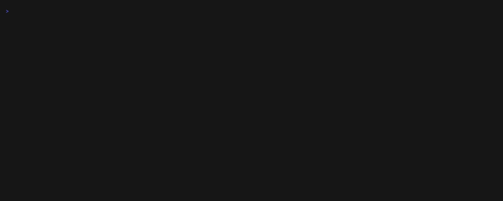

# runsweep

[](https://github.com/dmitriy86it/runsweep/actions/workflows/ci.yml)
[](https://scorecard.dev/viewer/?uri=github.com/dmitriy86it/runsweep)

Did the worm touch my CI? Retroactive blast radius for GitHub Actions — which runs pulled the bad package or action, what secrets they could see, what to rotate first.



The recording scans [runsweep-demo](https://github.com/dmitriy86it/runsweep-demo) with [`examples/drill.yaml`](examples/drill.yaml), a fire drill that pretends `is-number@7.0.0` and a pinned `actions/setup-node` SHA were compromised.

## Install

Download the latest release from [Releases](https://github.com/dmitriy86it/runsweep/releases) and verify it before running it: the signature of the checksum file, the archive's checksum, and its build provenance. Run it in an empty directory, so the globs match only the downloaded files.

```bash
gh release download -R dmitriy86it/runsweep -p '*_linux_amd64.tar.gz' -p checksums.txt -p checksums.txt.sigstore.json
cosign verify-blob checksums.txt --bundle checksums.txt.sigstore.json \
  --certificate-identity-regexp '^https://github\.com/dmitriy86it/runsweep/\.github/workflows/release\.yml@refs/tags/v' \
  --certificate-oidc-issuer https://token.actions.githubusercontent.com
sha256sum --ignore-missing -c checksums.txt     # macOS: shasum -a 256 --ignore-missing -c checksums.txt
gh attestation verify runsweep_*_linux_amd64.tar.gz -R dmitriy86it/runsweep
tar xzf runsweep_*_linux_amd64.tar.gz runsweep
```

Archives are named `runsweep_<version>_<os>_<arch>.tar.gz` (`.zip` on Windows) for linux, darwin and windows on amd64 and arm64.

Or build from source (Go 1.27+):

```bash
go install github.com/dmitriy86it/runsweep/cmd/runsweep@latest
```

## Usage

```bash
runsweep incidents                                          # built-in incident presets
runsweep incidents import MAL-2026-2307 -o incident.yaml    # build an incident file from OSV and npm
runsweep scan --incident axios-2026-03 --repo owner/name    # one or more repos (--repo is repeatable)
runsweep scan --incident ./incident.yaml --org my-org       # every repository of an organization
runsweep scan --incident tj-actions-2025-03 --repo owner/name --format json
runsweep scan --incident axios-2026-03 --repo owner/name --lookback 30d   # also re-runs of month-old runs
```

`--incident` takes a built-in preset id or a file: a value with a `/` or ending in `.yaml`/`.yml` is read as a file (write `./name`), anything else is only a preset id. `--since` / `--until` (RFC3339) override the incident window. On a terminal the report is a short colored summary (`--format text`); piped or redirected — for example in CI — it is Markdown (`--format md`), and `--format json` gives machine-readable output. Colors are off when `NO_COLOR` is set or `TERM=dumb`. Progress and warnings go to stderr.

`--lookback` (default `7d`, up to `30d`, the period GitHub allows re-runs) also lists runs created that long before the window, so a re-run started inside the window is scanned. Jobs that started and finished before the window are skipped.

Exit codes:

| Code | Meaning |
|---|---|
| `0` | every job checked, nothing AFFECTED or POSSIBLE |
| `1` | at least one job AFFECTED or POSSIBLE |
| `2` | error: bad flags or incident file, no token, token rejected (HTTP 401), organization could not be listed, nothing could be scanned |
| `3` | nothing AFFECTED or POSSIBLE, but not everything was checked: UNCHECKED jobs, skipped repositories, the scan was interrupted (Ctrl-C, API error), or no runs were found in a window that starts more than 90 days ago (GitHub may have deleted them) |

`1` wins over `2` and `3`: findings are reported even if the scan then stops on an error, such as a rejected token. An interrupted scan still prints the report of what it checked; what it did not reach is listed as `interrupted: not scanned`. A second Ctrl-C exits at once.

**Token.** runsweep uses `GITHUB_TOKEN`, then `GH_TOKEN`, or else `gh auth token`. It only reads. A fine-grained token needs read-only **Actions**, **Contents** and **Metadata** on the repositories you scan; a classic token needs `repo` for private repositories and no scope for public ones.

## Incident file format

```yaml
id: axios-2026-03
title: "axios 1.14.1 / 0.30.4 malicious release"
# when the bad artifact could be downloaded; jobs that ran in this window are scanned
window: {start: 2026-03-31T00:21:58Z, end: 2026-03-31T03:15:30Z}
npm:                       # compromised package versions
  - {name: axios, versions: ["1.14.1", "0.30.4"]}  # ["*"] alone: every version is malicious
actions:                   # compromised action commits (40-char SHAs)
  - {uses: tj-actions/changed-files, shas: ["0e58ed8671d6b60d0890c21b07f8835ace038e67"]}
iocs:                      # informational, not matched
  domains: [sfrclak.com]
  ips: [142.11.206.73]
refs:
  - https://osv.dev/vulnerability/MAL-2026-2307
```

`id`, `window` and at least one of `npm` / `actions` are required. Unknown fields are errors.

## Built-in incidents

| Preset | Incident |
|---|---|
| `axios-2026-03` | axios 1.14.1 / 0.30.4 malicious release |
| `chaindrop-2026-08` | Shai-Hulud wave: keyv / cacheable and 400+ npm packages |
| `tanstack-2026-05` | Mini Shai-Hulud wave: TanStack and 128 other npm packages, 170 packages / 432 versions (CVE-2026-45321) |
| `tj-actions-2025-03` | tj-actions/changed-files compromised (CVE-2025-30066) |
| `trivy-action-2026-03` | aquasecurity/trivy-action and setup-trivy tags hijacked (CVE-2026-33634) |

## Importing a new incident

`runsweep incidents import` turns OSV records into an incident file, so a new incident can be scanned minutes after it is published:

```bash
runsweep incidents import MAL-2026-2307 GHSA-g7cv-rxg3-hmpx -o incident.yaml   # OSV ids (MAL-, GHSA-, CVE-)
runsweep incidents import --package npm:axios                                   # every MAL-* record for a package
grep -o 'MAL-[0-9]*-[0-9]*' advisory.txt | runsweep incidents import            # ids on stdin, one per line
runsweep incidents import --action owner/repo@<40-hex sha> --since 2026-03-19T17:43:00Z --until 2026-03-20T06:00:00Z
```

It takes the npm versions OSV lists (an OSV range — with no versions listed, or with no fix — is expanded to the registry versions inside it; if none are, the package gets `["*"]`, every version), looks up their publish times in the npm registry and derives the window: the start is the earliest publish, the end is when the registry shows the versions removed, or now if any is still published. Packages are grouped by when their bad versions were first published; groups separated by more than 7 days are treated as separate waves. The largest group (the latest on a tie) and everything after it are kept, earlier groups are dropped as unrelated and listed in a comment (`--keep-all` keeps everything). A package is never split. Every assumption is written as a comment in the file; check them, and override the window with `--since` / `--until` when a source gives better times.

Ids on stdin are read only when no ids, `--package` or `--action` are given (at most 10 000). An import that has only `--action` needs `--since` and `--until`. GitHub Actions advisories are reported on stderr: OSV has no commit SHAs, so pass them with `--action`. The output is validated before it is written; `-o` replaces the file atomically. Only `api.osv.dev` and `registry.npmjs.org` are contacted. Any error, including an unknown subcommand, exits with `2`.

## How it decides

For each job that ran inside the window (including re-runs of runs created up to `--lookback` earlier), runsweep reads the job, its log, the workflow file — and the called workflow when the job runs a reusable workflow that is local or pinned to a commit SHA — and the lockfiles at the run's commit, and gives every job one status:

| Status | Meaning |
|---|---|
| **AFFECTED** | Proof the job used the bad artifact: a lockfile at the run's commit pins a bad version (dropped only when the job provably installs no packages), or the job log shows the bad action SHA was downloaded (or the workflow pins it). |
| **POSSIBLE** | It could have: a `package.json` declares the package without a lockfile entry covering it, or the workflow uses the action by a mutable ref (tag/branch) and the log is gone, so the resolved SHA is unknown. |
| **UNCHECKED** | Could not be checked: the run, log, commit tree or a file is unavailable or unparseable. Never reported as clean. |
| **CLEAN** | Checked and nothing found. |

For AFFECTED and POSSIBLE jobs the report lists what the job could read — secrets referenced by the job, `id-token: write`, cloud roles it could assume, `GITHUB_TOKEN` permissions — and merges them into a **Rotate first** list ordered by priority (cloud roles, then publish/deploy credentials, then third-party services).

## Limits

- GitHub deletes workflow runs, logs and checks after the repository's retention period (90 days by default). Older runs cannot be checked and show as UNCHECKED or are absent.
- Which secrets a job could read is derived from the workflow file at the run's commit; GitHub's API does not expose it directly.
- Priority by secret name is a name-based heuristic. Review the list; do not treat it as complete.
- A job whose log was unavailable is reported UNCHECKED: actions used via composite actions (and reusable workflows that are neither local nor pinned to a SHA) can only be seen in the log. Job logs over 64 MB count as unavailable.
- Lockfiles are assumed to be written by npm, pnpm or yarn; hand-edited lockfiles may be misread. `bun.lock`, `bun.lockb`, `deno.lock` and Yarn PnP (`.pnp.cjs`) are not read: their directory is at least UNCHECKED, also when an npm, pnpm or yarn lockfile next to them is read (it may be stale).
- A missing, unread or unsupported lockfile does not mark a job whose log shows no package install (npm, pnpm, yarn or bun output) and whose workflow installs none. A dependency on a package of the same repository (a workspace) is not reported as missing from the lockfile.
- An install whose output is fully suppressed inside a JS action or a called script is not seen.
- Packages named on the command line (`npm i axios`) are found only in the workflow's own `run:` steps, not in scripts it calls or in local composite actions.
- Only repositories the token can see are scanned; with `--org`, repositories it cannot see are not listed at all.
- Pull request runs are checked at the head commit of the pull request, not at the merge commit GitHub actually built.
- Container images (`container:`, `services:`, `docker://` actions) are not checked.
- Re-runs of runs created more than the lookback period (default 7 days) before the window are not scanned; use --lookback 30d for full coverage.
- Called workflows are read when local or pinned to a commit SHA, and in the scanned repository's owner or a public repository; others are judged from the caller job. A call into another owner's private repository is not read; the job is at least UNCHECKED.
- Workflow files over 1 MiB, lockfiles or `package.json` over 32 MB, and lockfiles and `package.json` files past the first 500 of a commit are not read; the job is at least UNCHECKED.
- npm and GitHub Actions only; no PyPI yet.

## Contributing incidents

See [CONTRIBUTING.md](CONTRIBUTING.md): start with `runsweep incidents import`, confirm every version or SHA with two independent sources, and explain the window in comments. If you cannot open a pull request, use the [new incident](https://github.com/dmitriy86it/runsweep/issues/new?template=new-incident.yml) issue form.

## License

[Apache-2.0](LICENSE)
